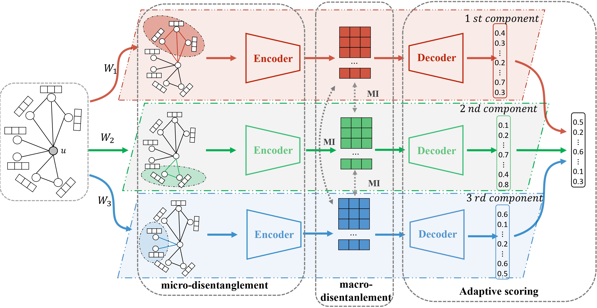

# DisenKGAT
<h1 align="center">
  DisenKGAT
</h1>

<h4 align="center">DisenKGAT: Knowledge Graph Embedding with Disentangled
Graph Attention Network</h4>


<h2 align="center">
  Overview of DisenKGAT
  
</h2>

This is our PyTorch implementation for the paper DisenKGAT-2021CIKM:

> Junkang Wu, Wentao Shi, Xuezhi Cao, Jiawei Chen, Fuzheng Zhang, Wei Wu, Xiangnan He (2021) DisenKGAT: Knowledge Graph Embedding with Disentangled Graph Attention Network
[paper link](https://dl.acm.org/doi/abs/10.1145/3459637.3482424). In CIKM2021.


<!--  -->
### Dependencies

- Compatible with PyTorch 1.8 and Python 3.6.
- Dependencies can be installed using `requirements.txt`.

### Dataset:

- We use FB15k-237 and WN18RR dataset for knowledge graph link prediction. 
- FB15k-237 and WN18RR are included in the `data` directory. 

### Training model:

- Install all the requirements from `requirements.txt.`

- Execute `sh ./preprocess.sh` for extracting the dataset and setting up the folder hierarchy for experiments.

- Commands for reproducing the reported results on link prediction:

  ```shell
  ##### with TransE Score Function
  # DisenKGAT (Composition: Subtraction)
  python run.py -epoch 1500 -name TransE_sub_K2_D200 -model disenkgat\
        -hid_drop 0.1 -gcn_drop 0.3 \
        -score_func transe -opn sub -data FB15k-237  \
        -init_dim 200 -mi_train -mi_method club_s -mi_drop

  # DisenKGAT (Composition: Multiplication)
  python run.py -epoch 1500 -name TransE_sub_K2_D200 -model disenkgat\
        -hid_drop 0.1 -gcn_drop 0.3 \
        -score_func transe -opn mult -data FB15k-237  \
        -init_dim 200 -mi_train -mi_method club_s -mi_drop
  
  # DisenKGAT (Composition: Crossover Interaction)
  python run.py -epoch 1500 -name TransE_sub_K2_D200 -model disenkgat\
        -hid_drop 0.1 -gcn_drop 0.3 \
        -score_func transe -opn cross -data FB15k-237  \
        -init_dim 200 -mi_train -mi_method club_s -mi_drop
  
  ##### with DistMult Score Function
  # DisenKGAT (Composition: Subtraction)
  python run.py -epoch 1500 -name Distmult_sub_K2_D200 -model disenkgat\
        -score_func distmult -opn sub -gcn_layer 2 -batch 128 -test_batch 128 
        -early_stop 66 -num_factors 2 -mi_train -mi_method club_s
  
  # DisenKGAT (Composition: Multiplication)
  python run.py -epoch 1500 -name Distmult_sub_K2_D200 -model disenkgat\
        -score_func distmult -opn mult -gcn_layer 2 -batch 128 -test_batch 128 
        -early_stop 66 -num_factors 2 -mi_train -mi_method club_s
  
  # DisenKGAT (Composition: Crossover Interaction)
  python run.py -epoch 1500 -name Distmult_sub_K2_D200 -model disenkgat\
        -score_func distmult -opn cross -gcn_layer 2 -batch 128 -test_batch 128 
        -early_stop 66 -num_factors 2 -mi_train -mi_method club_s
  
  ##### with InteractE Score Function
  # DisenKGAT (Composition: Subtraction)
  python run.py -epoch 1500 -name InteractE_sub_FB15k_K2_D200_club_b_mi_drop -model disenkgat\
        -score_func interacte -opn sub -num_factors 2 \
        -mi_train -mi_method club_b -mi_drop
  
  # DisenKGAT (Composition: Multiplication)
  python run.py -epoch 1500 -name Mult_InteractE_FB15k_K2_D200_club_b_mi_drop -model disenkgat\
        -score_func interacte -opn mult -num_factors 2 \
        -mi_train -mi_method club_b -mi_drop
  
  # DisenKGAT (Composition: Crossover Interaction)
  python run.py -epoch 1500 -name InteractE_FB15k_K3_D200_club_b_mi_drop -model disenkgat\
        -score_func interacte -opn cross -num_factors 3 \
        -mi_train -mi_method club_b -mi_drop

  ##### Overall BEST:
  python run.py -epoch 1500 -name InteractE_FB15k_K3_D200_club_b_mi_drop -mi_train -mi_drop
  ```

### Citation
If you want to use our codes in your research, please cite:
```
@inproceedings{wu2021disenkgat,
  title={DisenKGAT: Knowledge Graph Embedding with Disentangled Graph Attention Network},
  author={Wu, Junkang and Shi, Wentao and Cao, Xuezhi and Chen, Jiawei and Lei, Wenqiang and Zhang, Fuzheng and Wu, Wei and He, Xiangnan},
  booktitle={Proceedings of the 30th ACM International Conference on Information \& Knowledge Management},
  pages={2140--2149},
  year={2021}
}
```

## Acknowledgement
The project is built upon [COMPGCN](https://github.com/malllabiisc/CompGCN)


For any clarification, comments, or suggestions please create an issue or contact me.
